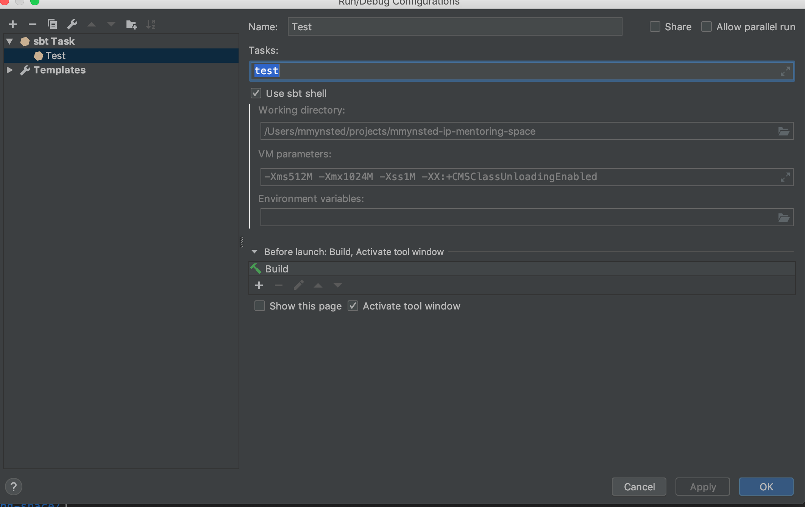

# README

The following are required:

- JDK 1.8
- Ammonite

Should also have plugins (scala, sbt, rainbow brackets, and scalafmt)

1. Create a new private github repo named `myid-ip-mentoring-space` via [https://github.com/new](https://github.com/new).
   
   Example: My private repository would be named `mmynsted-ip-mentoring-space`.
   Notice the url for this new private repo where it says quick setup.

2. Create a local bare repo and push it to the new.

```bash
git clone --bare git@github.com:inner-product/ip-mentoring-space.git 
cd ip-mentoring-space
```

Find the URL for your private folk from the first step and populate it.

```bash
git push --mirror git@github.com:mmynsted/mmynsted-ip-mentoring-space.git 
```

3. Remove the local `ip-mentoring-space` repo.
 
4. Clone your new _private fork_ locally
 
```bash
git clone git@github.com:mmynsted/mmynsted-ip-mentoring-space.git
```

5. _OPTIONAL_: Click on the settings tab of your private fork and add `mmynsted` as a collaborator.

6. When importing or opening in Intellij, select to use [sbt shell](https://www.jetbrains.com/help/idea/sbt-support.html#sbt_shell). 
   This project includes [Monix minitest](https://github.com/monix/minitest). The tests can be run from the 
   sbt shell manually using the `test` command or on file save with `~test` or by executing an sbt task. 
   
   You can set one up by clicking `Edit configurations` from the `Run` menu. You can use the `sbt` template and make 
   something that looks like this.
   
   
   
7. _OPTIONAL_: You may wish to create an upstream remote to make it easy to get updates.

```bash
git remote add upstream git@github.com:inner-product/ip-mentoring-space.git
```

You can fetch the changes with:

```bash
get fetch upstream
```

See [use.md](./use.md) for more information.